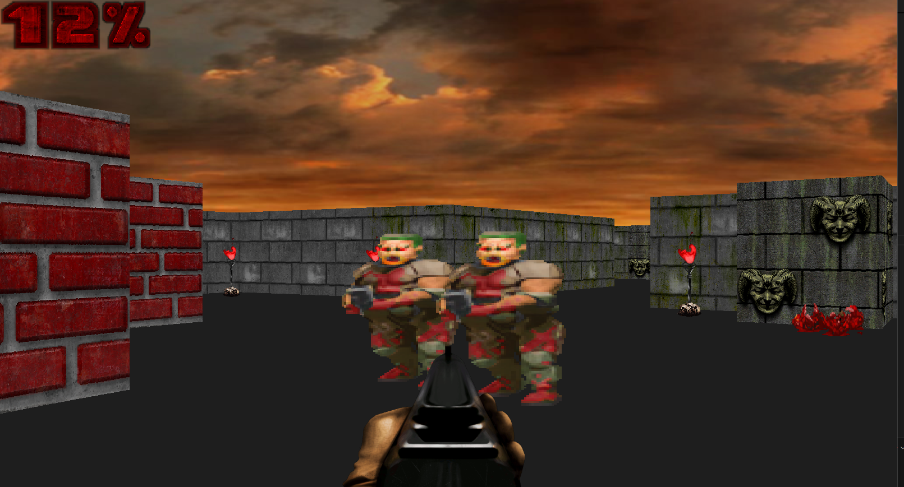

# Raycasting Game Engine

This project is a simple raycasting-based 3D game engine implemented in Python using the Pygame library. Inspired by classic games like *Wolfenstein 3D* and *DOOM*, the engine demonstrates fundamental concepts of rendering 3D environments using 2D maps, raycasting, and game mechanics.



---

## Features

- **Raycasting Rendering**: Simulates a 3D environment by casting rays in a 2D map.
- **Player Movement**: Smooth player navigation with a hidden mouse cursor and confined movement.
- **Weapon Mechanics**: Realistic weapon handling and animations.
- **AI Pathfinding**: Intelligent navigation for in-game entities using pathfinding algorithms.
- **Object Rendering**: 2D sprite and texture-based rendering for objects and environments.
- **Sound System**: Background music and sound effects to enhance the experience.
- **Customizable Settings**: Resolution, FPS, and other game parameters are easily adjustable.
- **Dynamic Events**: Global triggers for periodic events and interactions.

---

## Getting Started

### Prerequisites
- **Python 3.8+**: Download and install Python from [python.org](https://www.python.org/).
- **Pygame Library**: Install Pygame using `pip`:

  ```bash
  pip install pygame
  ```

# How to Play

- **Movement**: Use W, A, S, D for player movement.
- **Mouse Look**: Control the player's view with the mouse.
- **Fire Weapon**: Click the left mouse button to fire.
- **Pause/Exit**: Press Esc to quit the game.

# Code Overview

## Main Components

- **Game Class**: Handles initialization, game loop, and core updates.

## Modules

- **settings.py**: Configuration for game settings (resolution, FPS, etc.).
- **map.py**: Defines the 2D layout of the environment.
- **player.py**: Implements player controls and mechanics.
- **raycasting.py**: Core raycasting logic for rendering the 3D view.
- **object_renderer.py**: Handles visual rendering of walls, sprites, and textures.
- **sprite_object.py**: Manages 2D and 3D sprite entities.
- **object_handler.py**: Manages interactive game objects and their states.
- **weapon.py**: Implements weapon animations and interactions.
- **sound.py**: Controls sound effects and background music.
- **pathfinding.py**: Implements pathfinding logic for AI entities.

# Credits

This project was inspired by and partially based on by Clear Code

The 3D models used in this project are sourced from [Sprite Database](https://spritedatabase.net/game/760), specifically from the game featured on the site.
